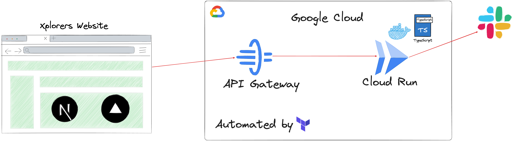

# Xplorers API

Xplorers API is the backend service for the Xplorers website and other related tasks. It provides endpoints to interact with Slack users and channels, among other functionalities.

## Table of Contents

-   [Architecture](#architecture)
-   [Prerequisites](#prerequisites)
    -  [Software](#software)
    -  [Access to Google Cloud Platform](#access-to-google-cloud-platform)
-   [Installation and Usage](#installation-and-usage)
-   [Contributing to the Xplorers API](#contributing-to-the-xplorers-api)
-   [Branching and Commits Strategy](#branching-and-commits-strategy)
    -   [Branching Strategy](#branching-strategy)
    -   [Branch Naming Conventions](#branch-naming-conventions)
    -   [Examples of Branch Names](#examples-of-branch-names)
    -   [Commits Strategy](#commits-strategy)
    -   [Conventional Commits Structure](#conventional-commits-structure)
    -   [Commit Message Format](#commit-message-format)
    -   [Examples of Commit Messages](#examples-of-commit-messages)

## Architecture



## Prerequisites

### Software

-   [Git](https://git-scm.com/downloads)
-   [Taskfile](https://taskfile.dev/#/installation)
-   [pnpm](https://pnpm.io/installation)
-   [Node.js](https://nodejs.org/en/download/)
-   [TypeScript](https://www.typescriptlang.org/download)
-   [Docker](https://docs.docker.com/get-docker/)
-   [Terraform](https://learn.hashicorp.com/tutorials/terraform/install-cli)
-   [Google Cloud CLI](https://cloud.google.com/sdk/docs/install)

## ❗️ [macOS Installation gCloud] 
In order for **gcloud** to be acessible globally, extract google-cloud-sdk into Home Directory

1. Navite to downloads folder or where google-cloud-cli is installed
    ```
    cd ~/Downloads
    ```
2. Extract and move (.tar.gz) file into `$home` path.
    ```
    tar -xzvf filename.tar.gz -C ~
    ```
3. Run the `install.sh` command
    ```
    cd ~/google-cloud-sdk  && ./install.sh
    ```

### Access to Google Cloud Platform

You will need access to the Google Cloud Platform to deploy the Xplorers API. If you don't have access, please contact the project owner.

Once you have access, login to Google Cloud via gcloud cli + setup application default credentials via Application Default Credentials (ADC),

Run [**_gcloud init_**](https://cloud.google.com/sdk/gcloud/reference/init) to authorize gcloud and other SDK tools to access Google Cloud using your user account credentials.

Run [**_gcloud auth application-default login_**](https://cloud.google.com/sdk/gcloud/reference/auth/login) to obtain access credentials for your user account via a web-based authorization flow. When this command completes successfully, it sets the active account in the current configuration to the account specified. If no configuration exists, it creates a configuration named default.

## Installation and Usage

To install and deploy a feature branch of the Xplorers API, follow these steps:

1. **Clone the repository**:

    ```sh
    git@github.com:xplorer-io/xplorers-api.git
    cd xplorers-api
    ```

2. **Install dependencies**:

    ```sh
     task install
    ```

3. **Update `TERRAFORM_WORKSPACE` in configuration/defaults.conf**

    The `TERRAFORM_WORKSPACE` variable in the `configuration/defaults.conf` file should be updated to the name of the github issue number you are working on.

    For example, if you are working on issue #1, the `TERRAFORM_WORKSPACE` variable should be set to `issue-1`.

    This ensures multiple developers can work on different issues concurrently without interfering with each other.

4. **Run terraform init**:

    This command initializes the Terraform working directory and downloads the required providers. This command also initializes the Terraform backend which is Google Cloud Storage in this case.

    ```sh
    task terraform-init
    ```

5. **Run terraform plan**:
   This command creates an execution plan. By default, it shows what actions Terraform will take to change the infrastructure. This command does not make any changes to the infrastructure and is safe to run to see what changes will be made.

    ```sh
    task terraform-plan
    ```

6. **Run terraform apply**:
   This command applies the changes required to reach the desired state of the configuration. This command will create the resources defined in the Terraform configuration.
    ```sh
    task terraform-apply
    ```

## Contributing to the Xplorers API

Contributions are welcome! Please follow these steps to contribute:

1. Git clone the repository.
2. Create a new branch (git checkout -b feat/issue-1_new-feature).
3. Make your changes.
4. Commit your changes (git commit -m 'feat(issue-1): Add new feature').
5. Push to the branch (git push origin feat/issue-1_new-feature).
6. Open a pull request for review.

## Branching and Commits Strategy

### Branching Strategy

When creating branches, please adhere to the following naming conventions to ensure clarity and consistency across the project. The branch name should provide relevant information about the work being done and include the issue number if it exists.

### Branch Naming Conventions

1. Feature Branches:

    - Use the prefix feat/ followed by the issue number and a brief description of the feature.
    - Example: `feat/issue-1_header`
    - This indicates that the branch is for a new feature related to issue #1, specifically for the header.

2. Bug Fix Branches:
    - Use the prefix bug/ followed by the issue number and a brief description of the bug fix.
    - Example: `bug/issue-10_login_auth`
    - This indicates that the branch is for fixing a bug related to issue #10, specifically for login authentication.

### Examples of Branch Names

-   `feat/issue-23_add_user_profile_page`
-   `bug/issue-45_fix_payment_gateway_error`
-   `chore/update_dependencies`
-   `docs/add_api_documentation`

### Commits Strategy

For commit messages, please follow [Conventional Commits](https://www.conventionalcommits.org/en/v1.0.0/) structure. This ensures that commit messages are consistent, informative, and can be easily parsed by automated tools.

### Conventional Commits Structure

A commit message should consist of a header, an optional body, and an optional footer. The header has a specific format that includes a type, an optional scope, and a subject.

### Commit Message Format

```
<type>(<scope>): <subject>
```

1. Type:

    - Describes the kind of change being made.
    - Possible values include feat, fix, docs, style, refactor, test, and chore.

2. Scope:

    - Describes the part of the codebase being affected by the change.
    - Optional but recommended.

3. Subject:
    - A brief description of the change.
    - Written in the imperative mood (e.g., "Add feature" instead of "Added feature").

### Examples of Commit Messages

-   `feat(auth): Add user authentication`
-   `fix(login): Fix login form validation`
-   `docs(api): Update API documentation`
-   `style(header): Format header component`
-   `refactor(utils): Refactor utility functions`
-   `test(api): Add tests for API endpoints`
-   `chore(deps): Update dependencies`
